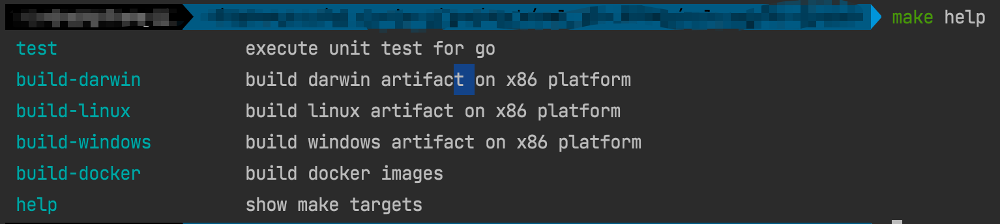
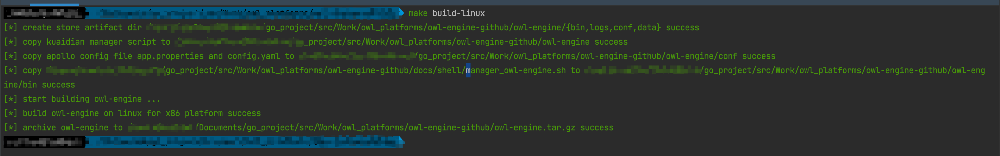

## owl-engine

### 简介

| 组件名称 | 版本  |
| :------ | :---- |
| go  | 1.14+ |
| web | gin-v1.7.2 |
| db  | gorm-v1.21.12 |
| log | zap v1.17.0 |

> 其他请见 go.mod 文件
>

### 安装

* 本地同步 develop 分支，提交后 merge 到 master 分支
* 克隆代码

    ```shell script
    git clone https://github.com/StalkerOne/owl-engine.git
    ```

    * 目录结构
      ```text
      ./owl-engine-github
       ├── Dockerfile                           # docker镜像构建文件
       ├── Makefile                             # make 编译文件
       ├── README.md                            # 说明文档  
       ├── cmd
       │   └── engine
       │       └── engine.go                    # cobra 应用入口
       ├── conf
       │   └── config.yaml                      # 配置文件
       ├── docs
       │   ├── db
       │   │   ├── init.sql                     # mysql 初始化文件
       │   │   └── init_rollback.sql            # 回滚文件
       │   └── shell
       │       ├── control.sh                   # 
       │       ├── darwin.sh                    # 生成MacOS 平台编译脚本
       │       ├── generate_scripts.sh          # 生成各类平台编译脚本和Makefile文件
       │       ├── linux.sh                     # 生成类linux 平台编译脚本
       │       ├── manager_owl-engine.sh        # 应用启停等管理脚本(重要)
       │       └── windows.sh                   # 生成windows 平台编译脚本
       ├── go.mod
       ├── go.sum
       ├── hadolint.yaml                        # 对于Dockerfile文件进行规范检测的配置文件
       ├── main.go                              # 程序入口
       ├── pkg
       │   ├── api
       │   │   ├── common
       │   │   │   └── param.go                 # URI 配置
       │   │   └── v0
       │   │       ├── healthy
       │   │       │   └── healthy.go
       │   │       └── rule                     # 各类gin路由
       │   │           ├── logger.go
       │   │           └── rule.go
       │   ├── client
       │   │   ├── database
       │   │   │   ├── database.go
       │   │   │   └── dbWork.go
       │   │   ├── influxdb
       │   │   │   └── influxdb.go
       │   │   ├── redis
       │   │   │   └── redis.go
       │   │   └── validator
       │   │       └── validator.go
       │   ├── config
       │   │   ├── config.go
       │   │   ├── event.go
       │   │   ├── influxdb.go
       │   │   ├── logger.go
       │   │   ├── mysql.go
       │   │   ├── redis.go
       │   │   └── server.go
       │   ├── dao
       │   │   ├── influxdb
       │   │   │   └── metric.go
       │   │   └── mysql
       │   │       ├── event
       │   │       │   └── event.go
       │   │       └── rule
       │   │           └── rule.go
       │   ├── lib
       │   │   └── job
       │   │       └── job.go
       │   ├── model
       │   │   ├── apiModel
       │   │   │   ├── logger.go
       │   │   │   └── math.go
       │   │   ├── constParam
       │   │   │   └── constant.go
       │   │   └── dbModel
       │   │       ├── alert.go
       │   │       ├── logger.go
       │   │       ├── math.go
       │   │       └── metric.go
       │   ├── service
       │   │   └── v0
       │   │       ├── calculate
       │   │       │   ├── common.go
       │   │       │   ├── logger.go
       │   │       │   ├── math.go
       │   │       │   └── warn.go
       │   │       └── rule
       │   │           ├── logger.go
       │   │           └── math.go
       │   ├── util
       │   │   ├── reflectutils
       │   │   │   ├── deep.go
       │   │   │   └── reflect.go
       │   │   ├── resp
       │   │   │   └── response.go
       │   │   ├── signals
       │   │   │   ├── signal.go
       │   │   │   ├── signal_posix.go
       │   │   │   └── signal_windows.go
       │   │   └── util.go
       │   └── xlogs
       │       ├── README.md
       │       ├── api.go
       │       ├── api_test.go
       │       ├── buffer_syncer.go
       │       ├── config.go
       │       ├── const.go
       │       ├── defer.go
       │       ├── log.go
       │       ├── rotate
       │       │   ├── chown.go
       │       │   ├── lumberjack_darwin.go
       │       │   ├── lumberjack_linux.go
       │       │   └── lumberjack_windows.go
       │       ├── rotate.go
       │       ├── stack.go
       │       └── strings.go
       └── router
       ├── middleware
       │   ├── auth.go
       │   ├── header.go
       │   ├── initialize.go
       │   └── logger.go
       ├── params.go
       └── router.go
      ```

* 生成项目管理脚本和Makefile文件以及各类目标平台编译脚本
    ```shell
    cd ./docs/shell
    bash generate_scripts.sh --project-name=owl-engine
  
    # 以上命令会生成如下的各类编译和管理脚本
    control.sh
    darwin.sh
    generate_scripts.sh
    linux.sh
    manager_owl-engine.sh
    windows.sh
    ```

* 编译部署
    ```shell script
    cd <项目家目录下>
    make help
    make build-<Compilation platform>

    # 案例
    make build-linux

    # 生产环境, 其配置请求的是 Apollo
    export OWL_ENGINE_MODE=prod; bash manager_owl-engine.sh owl-engine status

    # 开发或测试环境是解析本地配置文件
    export OWL_ENGINE_MODE=dev; bash manager_owl-engine.sh owl-engine status
    ```
  > 应用的启动命令: ./owl-engine server -t [apollo|file] [-c conf/config.yaml]
  > 详情可查看: manager_owl-engine.sh 脚本说明
  >
  
  

* 构建完成后的工件目录构成
    ```text
    ├── bin
    │   ├── app.properties                  # Apollo 配置文件
    │   ├── manager_owl-engine.sh           # 项目管理脚本
    │   ├── owl-engine                      # 可执行二进制文件
    │   └── owl-engine-application.json     # Apollo 生成的配置文件
    ├── conf                                # 配置文件目录
    │   └── config.yaml                     # 默认的本地测试文件
    ├── data                                # 数据目录
    └── logs                                # 日志存储目录
        └── owl-engine.log                  # 日志文件
    ```